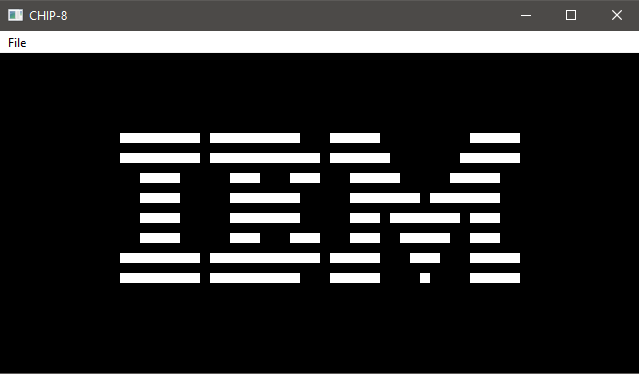

# CHIP-8 Emulator

A CHIP-8 emulator written in C, wrapped in Qt. Built as a learning project to gain low-level C experience, emulation, and to (hopeflly) build up to a larger emulator like a GameBoy.

CHIP-8 is an interpreted programming language from the 1970s, originally designed to make game development easier on early microcomputers. It's not a real hardware system, but a virtual machine that runs on top of whatever hardware you have.

It's become the "hello world" of emulator development because it's simple to build but teaches you everything you need to know before tackling other emulators.

---

## Repo Structure

- `chip8/` — the emulator (C core + Qt frontend)
- `keypad/` — optional Pi Pico firmware for a physical CHIP-8 keypad (USB HID)
- `docs/` — reference material
- `roms/` — CHIP-8 ROMS

## Specs

- **Memory:** 4 KB RAM
  - `0x000–0x1FF` — reserved (interpreter, font data lives here)
  - `0x200` — ROM loads here; PC starts here
  - `0xFFF` — top of RAM
- **Display:** 64×32 pixels, monochrome
- **Font:** 16 characters (0–F), each 5 bytes tall, stored at `0x050–0x09F`
- **PC:** points to the current instruction in memory
- **Index register I:** 16-bit, points at locations in memory
- **Stack:** holds 16-bit addresses for subroutine calls/returns
- **Delay timer:** 8-bit, decremented at 60 Hz
- **Sound timer:** 8-bit, same as delay timer; emits a beep while non-zero
- **Registers:** 16 × 8-bit general-purpose (V0–VF); VF doubles as a flag register

### Currently Implemented Opcodes

| Opcode | Description |
|--------|-------------|
| `00E0` | Clears screen |
| `00EE` | Returns from subroutine |
| `1NNN` | Jumps to address NNN |
| `2NNN` | Calls subroutine at NNN |
| `3XNN` | Skips if reg VX == NN |
| `4XNN` | Skips if reg VX != NN |
| `5XY0` | skips if reg VX == VY |
| `6XNN` | Set reg VX = NN |
| `7XNN` | Adds NN to register VX |
| `8XYN` | ALU - Arithmetic and Bitwise operations |
| `9XY0` | Skips if VX != VY |
| `ANNN` | Sets index register I = NNN |
| `DXYN` | Draws sprite at (VX, VY), N bytes tall |

---

## Hardware Keypad

A physical 4x4 keypad built on perfboard, driven by a Raspberry Pi Pico
running custom firmware (in `keypad/`). It enumerates as a standard USB
HID keyboard, so no special driver is needed, the emulator reads it the
same way it reads a regular keyboard.

**Status:** 8 of 16 buttons wired and mapped (1,2,3,C / 4,5,6,D). Full
build/flash instructions coming once the hardware is complete.

**IBM Logo ROM**



**In progress / TODO**

- Remaining opcodes
- Keyboard input
- Finish keypad
- Timers (delay + sound)
- More menu bar options

---

## Dependencies

**Linux / WSL (Ubuntu/Debian):**

```sh
sudo apt update
sudo apt install build-essential cmake qt6-base-dev
```

**Windows 10/11:**

- Install [MSYS2](https://www.msys2.org/)
- Open MSYS2 MINGW64

```sh
pacman -S mingw-w64-x86_64-gcc mingw-w64-x86_64-cmake mingw-w64-x86_64-make mingw-w64-x86_64-qt6-base
```

- Add ``` C:\msys64\mingw64\bin ``` to Windows System PATH

---

## Build & Run

**Linux / WSL (Ubuntu/Debian):**

```sh
chmod +x build-linux.sh
./build-linux.sh          # Linux build script
./CHIP-8                  # Run the binary
```

**Windows 10/11:**

- Run the following in MSYS2 MINGW64

```sh
cd /c/.../CHIP8-Emu
./build-windows.sh        # Windows build script
./build/CHIP-8.exe        # Run the binary
```

---

## References

- https://tobiasvl.github.io/blog/write-a-chip-8-emulator/
- http://devernay.free.fr/hacks/chip8/C8TECH10.HTM#0.1
- https://doc.qt.io/qt-6/
- https://www.raspberrypi.com/documentation/pico-sdk/
- https://github.com/hathach/tinyusb